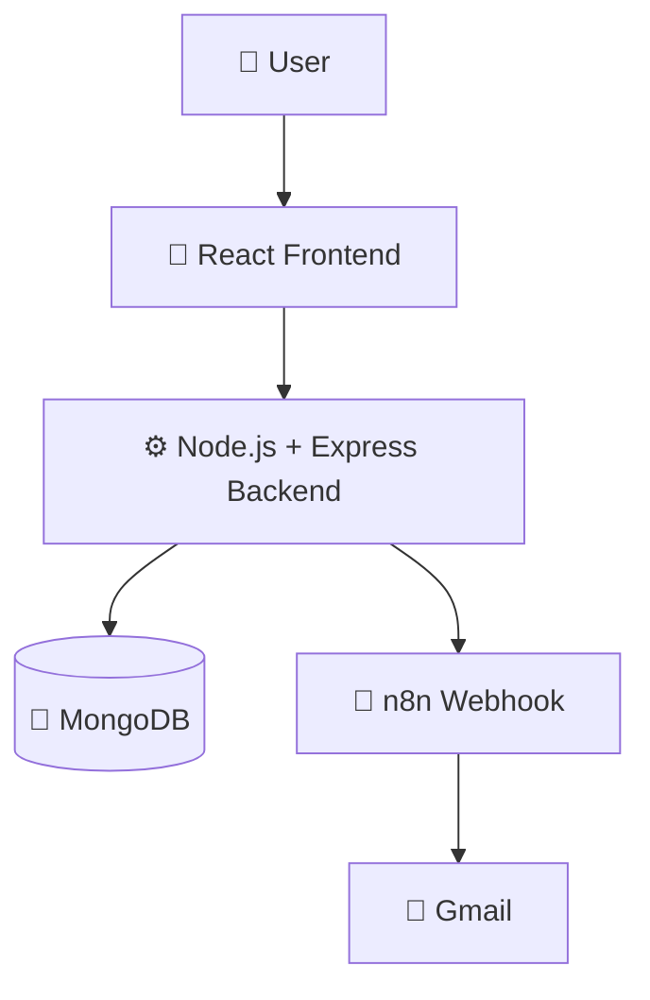
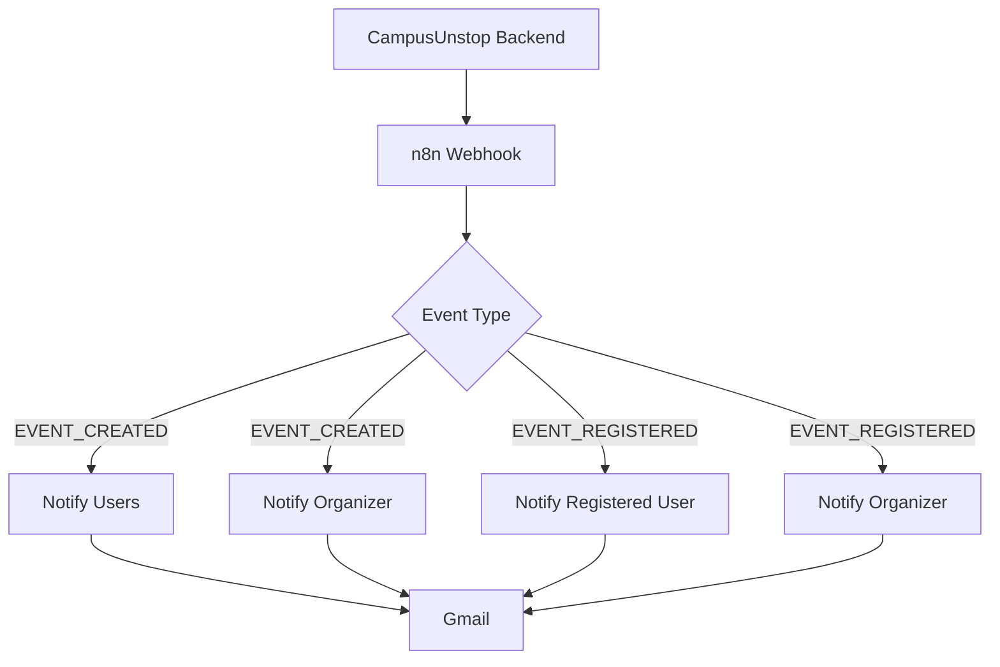
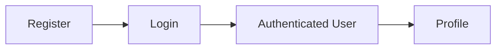
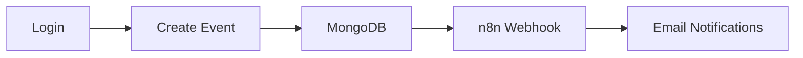
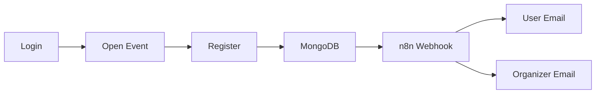
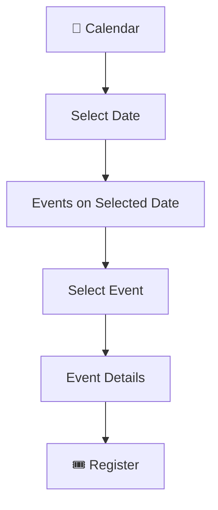

# 🎓 CampusUnstop

> A full-stack campus event management platform that connects students with campus opportunities and gives organizers a simple way to create and manage events.

## 🌐 Live Application

**Frontend:** https://campus-unstop-hazel.vercel.app/  
**GitHub:** https://github.com/saivallabha37/CampusUnstop

---

## ✨ Features

### 👤 Authentication & Users
- User registration and login
- JWT-based authentication
- Secure password hashing with bcrypt
- Protected routes
- User profiles

### 🎉 Event Management
- Create events
- View upcoming events
- Edit and delete events
- Event categories
- Event descriptions
- Date and time
- Location
- Registration deadlines
- Participant capacity
- Organizer information

### 🎟️ Event Registration
- Register for events
- Capacity validation
- Registration deadline validation
- Track registered participants
- Registration confirmation
- Organizer notification when someone registers

### 📧 Automated Notifications
CampusUnstop integrates with n8n and Gmail to automate event notifications.

**When an event is created**
- Users receive a new-event notification.
- The organizer receives a confirmation that the event was created successfully.

**When a user registers**
- The registered user receives a confirmation email.
- The organizer receives a notification containing the registered user's information.

---

# 🏗️ System Architecture

CampusUnstop follows a full-stack architecture connecting the frontend, backend, database, and notification automation system.



### Main Components

| Component | Technology | Purpose |
|---|---|---|
| Frontend | React.js | User interface and event interaction |
| Backend | Node.js + Express.js | REST APIs and business logic |
| Database | MongoDB | Users, events and registrations |
| Authentication | JWT + bcrypt | Secure authentication |
| Automation | n8n | Event-based notification workflows |
| Email | Gmail | Automated email notifications |
| Frontend Hosting | Vercel | Web application hosting |
| Backend Hosting | Render | API hosting |

---

# 🛠️ Tech Stack

## Frontend
- React.js
- React Router
- JavaScript
- Tailwind CSS
- React Bits
- OGL
- CSS

## Backend
- Node.js
- Express.js
- MongoDB
- Mongoose
- JWT
- bcryptjs
- CORS
- dotenv

## Automation & Services
- n8n
- Gmail
- MongoDB Atlas

## Deployment
- Vercel
- Render
- MongoDB Atlas
- n8n Cloud

---

# 📁 Project Structure

```text
CampusUnstop/
├── backend/
│   ├── controllers/
│   │   ├── authController.js
│   │   ├── bookingController.js
│   │   └── eventController.js
│   ├── middleware/
│   │   └── auth.js
│   ├── models/
│   │   ├── Booking.js
│   │   ├── Event.js
│   │   └── User.js
│   ├── routes/
│   │   ├── auth.js
│   │   ├── bookings.js
│   │   └── events.js
│   ├── services/
│   │   └── notificationService.js
│   ├── extract_db.js
│   ├── seed.js
│   ├── server.js
│   ├── package.json
│   └── package-lock.json
├── frontend/
│   ├── public/
│   ├── src/
│   ├── package.json
│   ├── package-lock.json
│   ├── tailwind.config.js
│   └── postcss.config.js
├── .gitignore
└── README.md
```

---

# 🚀 Getting Started

## Prerequisites

Make sure you have:

- Node.js
- npm
- MongoDB or MongoDB Atlas
- Git

## 1. Clone the repository

```bash
git clone https://github.com/saivallabha37/CampusUnstop.git
cd CampusUnstop
```

---

# ⚙️ Backend Setup

```bash
cd backend
npm install
```

Create a `.env` file inside `backend`:

```env
PORT=5000
MONGODB_URI=your_mongodb_connection_string
JWT_SECRET=your_jwt_secret
N8N_NOTIFICATION_WEBHOOK_URL=your_n8n_webhook_url
```

Start the backend:

```bash
npm start
```

For development:

```bash
npm run dev
```

Backend:

```text
http://localhost:5000
```

---

# 💻 Frontend Setup

Open another terminal:

```bash
cd frontend
npm install
npm start
```

Frontend:

```text
http://localhost:3000
```

---

# 🔗 API Structure

## Authentication

### Register

```http
POST /api/auth/register
```

### Login

```http
POST /api/auth/login
```

## Events

### Get all events

```http
GET /api/events
```

### Get event by ID

```http
GET /api/events/:id
```

### Create event

```http
POST /api/events
```

### Update event

```http
PUT /api/events/:id
```

### Delete event

```http
DELETE /api/events/:id
```

## Bookings

### Register for an event

```http
POST /api/bookings/register
```

### Get user bookings

```http
GET /api/bookings/user/:userId
```

---

# 📧 n8n Notification System

CampusUnstop uses n8n as an automation layer between the backend and Gmail.



## EVENT_CREATED

When an organizer creates an event:

1. The event is stored in MongoDB.
2. The backend sends an `EVENT_CREATED` webhook to n8n.
3. n8n processes the event.
4. Users receive a new-event notification.
5. The organizer receives an event-created confirmation.

## EVENT_REGISTERED

When a user registers:

1. The registration is stored in MongoDB.
2. The backend sends an `EVENT_REGISTERED` webhook to n8n.
3. n8n identifies the registered user and organizer.
4. The registered user receives a confirmation email.
5. The organizer receives a registration notification.

---

# 🔐 Environment Variables

Never commit `.env` files or secret credentials to GitHub.

```env
PORT=5000
MONGODB_URI=your_mongodb_uri
JWT_SECRET=your_jwt_secret
N8N_NOTIFICATION_WEBHOOK_URL=your_n8n_webhook_url
```

For production, configure these variables through Render or your deployment platform.

---

# 🌍 Deployment

## Frontend — Vercel

Set the root directory to:

```text
frontend
```

Build command:

```bash
npm run build
```

## Backend — Render

Set the root directory to:

```text
backend
```

Build command:

```bash
npm install
```

Start command:

```bash
node server.js
```

Configure the required environment variables in Render.

---

# 🧪 Testing

## Authentication Flow



## Event Creation Flow



## Event Registration Flow



---

# 🛡️ Security

Current security mechanisms include:

- JWT authentication
- Password hashing with bcrypt
- Protected API routes
- Environment variables
- CORS configuration
- Backend validation

Additional production-level security improvements are planned.

---

# 🗺️ Roadmap

## 🔐 Authentication & Security

- [ ] Firebase Authentication
- [ ] Email verification
- [ ] College email/domain verification
- [ ] CAPTCHA / bot protection
- [ ] Rate limiting
- [ ] Improved role-based authorization
- [ ] Strong organizer ownership validation

## 🎟️ Registration Improvements

- [ ] Prevent duplicate event registration
- [ ] Database-level unique registration constraint
- [ ] "Already Registered" UI state
- [ ] Registration history
- [ ] Better capacity handling
- [ ] Registration cancellation

## 🎨 Event UI Improvements

- [ ] Redesign event cards
- [ ] Remove unnecessary information from event cards
- [ ] Show only essential information in event listings
- [ ] Dedicated event details page
- [ ] Event image upload
- [ ] Event image URL support
- [ ] Event status badges
- [ ] Improved responsive design

### Planned Event Card

```text
┌──────────────────────────────┐
│          EVENT IMAGE         │
├──────────────────────────────┤
│ 🏷️ Technical                │
│                              │
│ Hackathon 2026               │
│ Build • Innovate • Win       │
│                              │
│ 📅 Aug 25                    │
│ 📍 Hyderabad                 │
│ 👥 24 / 50                   │
│                              │
│        View Event →          │
└──────────────────────────────┘
```

Full event information will be available after opening the event.

---

# 📅 Calendar

CampusUnstop will provide a dedicated calendar where students can discover events based on their dates.



Users will be able to:

- View events organized by date
- Select a specific day
- See all events scheduled for that day
- Open individual event details
- Register directly from event details

### Planned Navigation

```text
Home
Events
Calendar
My Events
Create Event
Profile
```

---

# 👤 My Events

A personalized section is planned where users can view their registered events.

### Upcoming Events

Events they have registered for.

### Past Events

Events they previously attended or registered for.

---

# 🔍 Search & Filters

Planned event discovery improvements include:

### Search

```text
🔍 Search events...
```

### Category Filters

- All
- Technical
- Cultural
- Sports
- Workshop
- Other

### Additional Filters

- Upcoming
- This Week
- This Month
- Most Popular
- Registration Status

---

# 📊 Organizer Dashboard

Organizers will eventually have a dedicated dashboard.

Planned features:

- View created events
- Edit events
- Delete events
- View registrations
- View participant lists
- Registration statistics
- Event analytics

---

# 🔔 Future Notifications

Additional notification types are planned:

- Event reminders
- Registration deadline reminders
- Event cancellation notifications
- Event schedule change notifications
- Event capacity warnings
- "Event tomorrow" notifications
- "Registration closing soon" notifications

---

# 🎯 Project Vision

CampusUnstop aims to become a centralized platform for campus opportunities.

Instead of students depending on scattered:

- WhatsApp groups
- Posters
- Social media
- Club announcements
- Separate registration links

CampusUnstop brings opportunities together in one platform.

The goal is to make campus opportunities easier to **discover, manage, and participate in**.

---

# 📈 Future Vision

CampusUnstop can eventually expand into:

- Inter-college events
- Hackathons
- Workshops
- Competitions
- Club activities
- Seminars
- Sports events
- Cultural events
- Placement-related events
- Certification programs
- Student communities
- Event analytics
- Personalized event recommendations

---

# 👨‍💻 Author

## Sai Vallabha Linga

GitHub:  
https://github.com/saivallabha37

---

# 🤝 Contributing

Contributions, suggestions, and improvements are welcome.

```bash
git clone https://github.com/saivallabha37/CampusUnstop.git
```

Create a branch:

```bash
git checkout -b feature/your-feature
```

Make your changes:

```bash
git add .
git commit -m "Add your feature"
```

Push your branch:

```bash
git push origin feature/your-feature
```

Then open a Pull Request.

---

# 📄 License

This project is currently intended for educational, development, and demonstration purposes.

